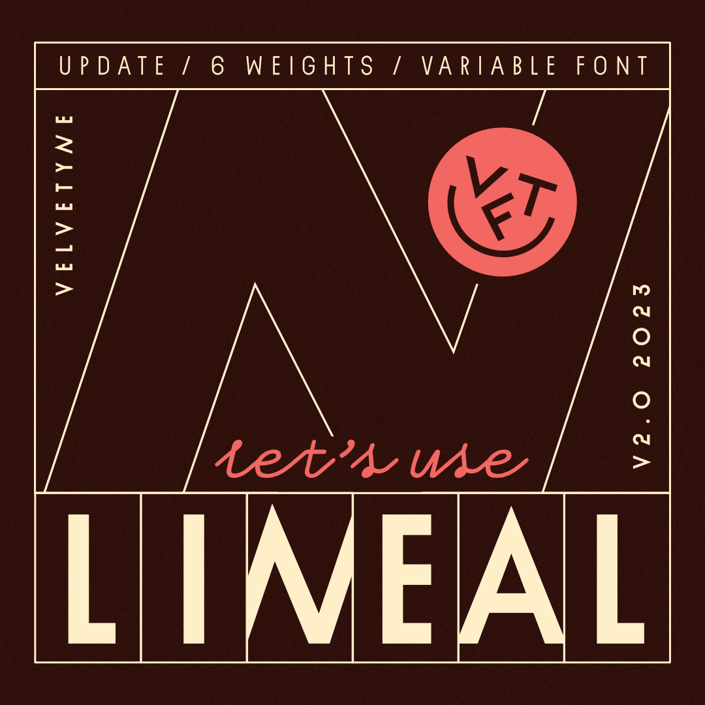
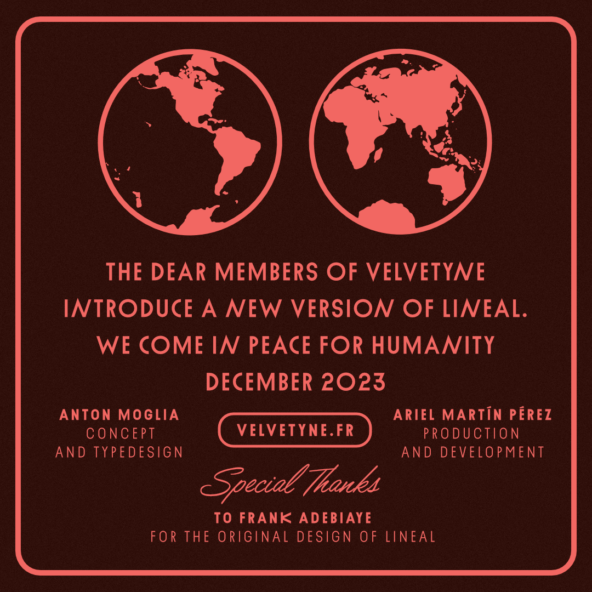

# Lineal
Version 2.O

### English

Lineal is a Libre Family initiated by Frank Adebiaye and updated by the Velvetyne Team.

According to Frank, Lineal was originally inspired by the song "2870" by Gérard Manset. It ended-up looking like a sort of Futura built with modules, without any optical corrections. Its first version was drawn in 2010 with FontForge 2.0. and published on Velvetyne on February 2011.

Since 2019, Anton Moglia worked on enhancing the character set, to fit his own needs (with Glyphs App). It was largely developed by Anton Moglia, who reviewed all the capitals, added lowercase letters and other symbols and gave it a more stable structure. He extended the family by adding weights, from Thin to Heavy and cleaned up the entire character set of superfluous curve points.

During 2023, Ariel Martin Perez helped Anton Moglia publish this substantial update of Lineal, developing the character set for other languages and helping build the repository for publication. Ariel Martín Pérez expanded language support and improved spacing and kerning.

### Français

Lineal est une famille libre initiée par Frank Adebiaye et mise à jour par l'équipe de Velvetyne.

Selon Frank, le Lineal a été inspiré à l'origine par la chanson "2870" de Gérard Manset. Elle a fini par ressembler à une sorte de Futura construite avec des modules, sans aucune correction optique. Sa première version a été dessinée en 2010 avec FontForge 2.0. et publiée sur Velvetyne en février 2011.

Depuis 2019, Anton Moglia a travaillé à l'amélioration du jeu de caractères, pour l'adapter à ses propres besoins (avec Glyphs app). Lineal a été largement développé par Anton Moglia, qui a revu toutes les capitales, ajouté des minuscules et d'autres symboles et lui a donné une structure plus stable. Il a élargi la famille en ajoutant des graisses, de Thin à Heavy, et a nettoyé l'ensemble du jeu de caractères des points de courbe superflus.

En 2023, Ariel Martín Pérez a aidé Anton Moglia à publier cette importante mise à jour de Lineal, en développant le jeu de caractères pour d'autres langues et en aidant à construire le dossier pour la publication. Ariel Martín Pérez a étendu la prise en charge des langues et a amélioré l'espacement et le crénage.

## Specimen

## License

This Font Software is licensed under the SIL Open Font License, Version 1.1.
This license is copied below, and is also available with a FAQ at
http://scripts.sil.org/OFL

## Repository Layout

This font repository follows the Unified Font Repository v2.0, a standard way to organize font project source files. Learn more at https://github.com/raphaelbastide/Unified-Font-Repository

## Contact

Original font

Frank Adebiaye

[Website](https://www.fadebiaye.com/)

[Instagram](https://www.instagram.com/fadebiaye/ "@fadebiaye")

[Mail](mailto:fadebiaye@gmail.com)

Version 2.0

Anton Moglia

[Website](https://anton.moglia.fr/)

[Instagram](https://www.instagram.com/anton.moglia/)

[Mail](mailto:hello@maous.fr)

Ariel Martín Pérez

[Website](https://appliedmetaprojects.com/)

[Instagram](https://www.instagram.com/appliedmetaprojects/)

[Mail](mailto:contact@appliedmetaprojects.com)
